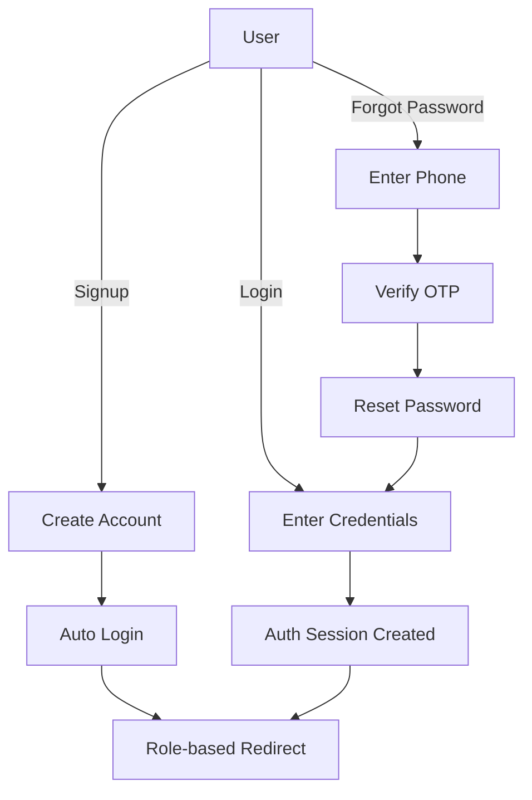

# Authentication Pages Guide

## 📊 Status Overview

| Page | Status | Backend Integration | Notes |
|------|--------|-------------------|-------|
| **Login** | ✅ Complete | ✅ Connected | Fully functional |
| **Signup** | ✅ Complete | ✅ Connected | Fully functional |
| **Forgot Password** | ⚠️ UI Ready | ❌ Mock Only | Needs backend API |

---

## ✅ Login Page (`/auth/login`)

**Location:** `src/app/auth/login/page.tsx`

### Features:
- ✅ Email & password validation
- ✅ Show/hide password toggle
- ✅ "Remember me" functionality via cookies
- ✅ Error handling (401, network errors, etc.)
- ✅ Loading states
- ✅ Links to signup and forgot password
- ✅ Integrated with `AuthContext`
- ✅ Redirect after login (supports `?next=` query param)

### Backend Endpoints Used:
- `POST /auth/login` - Login with email & password
- `GET /auth/session` - Check current session

### Testing:
```bash
# Start your dev server
npm run dev

# Visit: http://localhost:3000/auth/login
# Try logging in with valid credentials
```

---

## ✅ Signup Page (`/auth/signup`)

**Location:** `src/app/auth/signup/page.tsx`

### Features:
- ✅ Comprehensive registration form
  - First Name & Last Name
  - Email address
  - Contact number
  - Physical address (textarea)
  - Role selection (Farmer, Consumer, Driver)
  - Password & confirmation
- ✅ Field-level validation
- ✅ Password strength requirements
- ✅ Show/hide password toggles
- ✅ Backend error handling
- ✅ Auto-login after successful registration
- ✅ Role-based redirect after signup

### Backend Endpoints Used:
- `POST /auth/signup` - Create new user account

### Payload Format:
```typescript
{
  first_name: string,    // Also sends firstName
  last_name: string,     // Also sends lastName  
  contact_number: string, // Also sends contactNumber
  email: string,
  role: 'farmer' | 'consumer' | 'driver',
  address: string,
  password: string
}
```

### Password Requirements:
- Minimum 6 characters
- At least one uppercase letter
- At least one lowercase letter
- At least one number

### Testing:
```bash
# Visit: http://localhost:3000/auth/signup
# Fill out all fields and submit
# Should auto-login and redirect based on role:
# - Farmer → /dashboard/farmer
# - Consumer → /dashboard/consumer
# - Driver → /dashboard/driver
```

---

## ⚠️ Forgot Password Page (`/auth/forgot-password`)

**Location:** `src/app/auth/forgot-password/page.tsx`

### Current Status:
**UI is complete** but uses **mock/simulated API calls**. You need to implement the backend endpoints.

### Features:
- ✅ 3-step password reset flow
  1. Enter contact number
  2. Verify OTP (6 digits)
  3. Reset password
- ✅ OTP timer (60 seconds with resend)
- ✅ Form validation for each step
- ✅ Password strength validation
- ✅ Progress indicator
- ✅ Back navigation between steps
- ❌ **Backend integration (TODO)**

### Required Backend Endpoints:

#### 1. Send OTP
```typescript
POST /auth/forgot-password/send-otp
Body: { contactNumber: string }
Response: { success: boolean, message: string }
```

#### 2. Verify OTP
```typescript
POST /auth/forgot-password/verify-otp
Body: { contactNumber: string, otp: string }
Response: { success: boolean, token?: string }
```

#### 3. Reset Password
```typescript
POST /auth/forgot-password/reset
Body: {
  contactNumber: string,
  otp: string,
  newPassword: string
}
Response: { success: boolean, message: string }
```

### To Connect Backend:

1. **Uncomment the API calls in the file:**
   - Look for `// TODO:` comments
   - Uncomment the `apiRequest()` calls
   - Remove the mock `setTimeout()` calls

2. **Update endpoint paths** to match your backend API

3. **Test the flow:**
```bash
# Visit: http://localhost:3000/auth/forgot-password
# Enter phone number → Should receive OTP
# Enter OTP → Should verify
# Set new password → Should redirect to login
```

---

## 🔧 Environment Configuration

**File:** `.env.local` (already created for you)

```env
# Backend API Configuration
NEXT_PUBLIC_API_BASE_URL=http://localhost:5000

# Optional configurations:
# NEXT_PUBLIC_API_PATH_PREFIX=/api/v1
# NEXT_PUBLIC_USE_API_REWRITE=false
```

### Update this when:
- Running backend on different port
- Deploying to production
- Using API versioning (/api/v1, etc.)

---

## 🎨 UI Components Used

All pages use **shadcn/ui** components:
- `Button`, `Input`, `Label`, `Card`
- `Alert`, `Select`, `Textarea`
- Icons from `lucide-react`
- Tailwind CSS for styling

---

## 🔐 Authentication Flow



### Session Management:
- Sessions stored via HTTP-only cookies
- Auto-refresh every 10 minutes
- Refresh on window focus
- Logout clears session

---

## 🚀 Next Steps

### For Forgot Password:
1. ✅ ~~Create `.env.local`~~ (Done)
2. ✅ ~~Add router redirect~~ (Done)
3. ⏳ Implement backend OTP endpoints
4. ⏳ Uncomment API calls in forgot-password page
5. ⏳ Test full flow

### Optional Enhancements:
- [ ] Add email-based password reset (alternative to phone)
- [ ] Add CAPTCHA to prevent abuse
- [ ] Add rate limiting feedback
- [ ] Add "resend OTP" with cooldown
- [ ] Add success toast notifications
- [ ] Add password strength meter
- [ ] Add social login (Google, Facebook, etc.)
- [ ] Add two-factor authentication

---

## 🐛 Common Issues & Solutions

### Issue: "API endpoint not found"
**Solution:** Check your backend is running and `.env.local` has correct URL

### Issue: "CORS error"
**Solution:** Backend needs to allow credentials and frontend origin:
```javascript
// Backend CORS config
app.use(cors({
  origin: 'http://localhost:3000',
  credentials: true
}));
```

### Issue: "Session not persisting"
**Solution:** Ensure cookies are sent with `credentials: 'include'` (already configured in `api.ts`)

### Issue: Validation errors not showing
**Solution:** Backend should return errors in this format:
```json
{
  "error": "VALIDATION_ERROR",
  "message": "Validation failed",
  "details": {
    "fields": {
      "email": "Email already in use",
      "password": "Password too weak"
    }
  }
}
```

---

## 📝 Testing Checklist

### Login Page:
- [ ] Valid credentials → successful login
- [ ] Invalid credentials → error message
- [ ] Empty fields → validation errors
- [ ] Password toggle works
- [ ] "Forgot password" link works
- [ ] "Sign up" link works
- [ ] Redirects after login

### Signup Page:
- [ ] All fields validated
- [ ] Password requirements enforced
- [ ] Password confirmation matches
- [ ] Role selection works
- [ ] Duplicate email → error
- [ ] Successful signup → auto-login
- [ ] Redirects by role

### Forgot Password:
- [ ] Phone validation works
- [ ] OTP sent (check backend logs)
- [ ] OTP verification works
- [ ] Invalid OTP → error
- [ ] Password reset successful
- [ ] Redirects to login
- [ ] Timer counts down
- [ ] Resend OTP works

---

## 📚 Additional Resources

- **AuthContext:** `src/context/AuthContext.tsx`
- **API Helper:** `src/lib/api.ts`
- **UI Components:** `src/components/ui/`
- **Next.js Docs:** https://nextjs.org/docs
- **shadcn/ui:** https://ui.shadcn.com

---

**Last Updated:** October 14, 2025
**Status:** Login & Signup fully functional, Forgot Password needs backend
